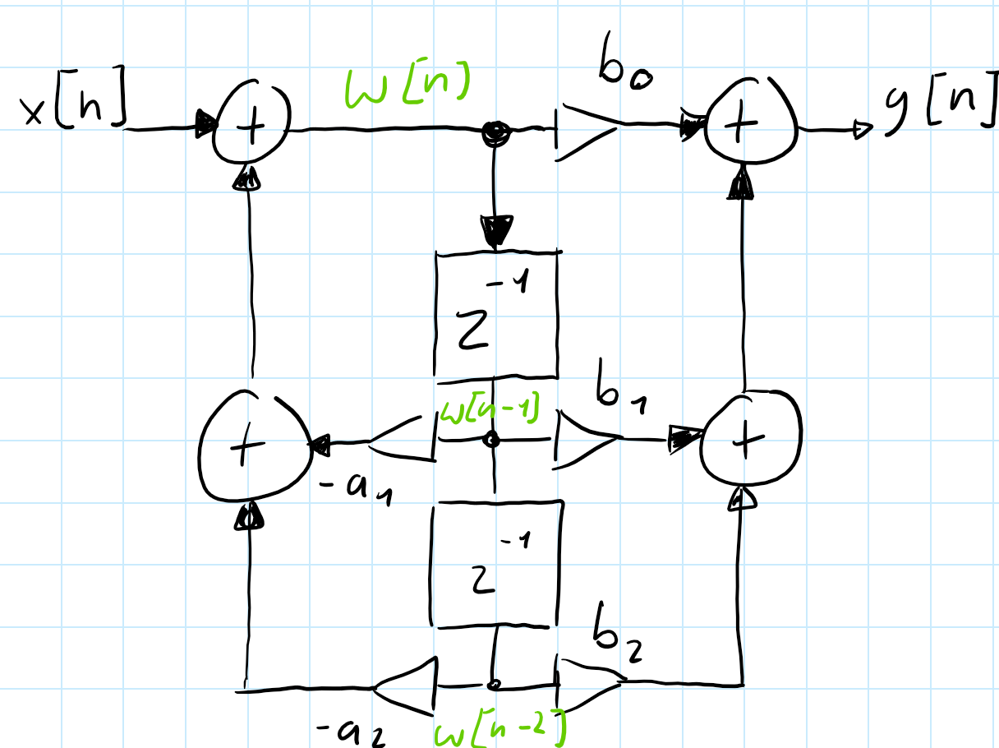

# Theoretische Grundlagen
Die nachfolgenden theoretischen Grundlagen dienen dem Verständnis der Konzepte und Verfahren, die in der vorliegenden Arbeit zur digitalen Signalverarbeitung, insbesondere im Kontext digitaler IIR-Filter, Anwendung finden. Dabei wird auf etablierte Literatur aus dem Bereich der digitalen Signalverarbeitung zurückgegriffen. 

Dabei stützen sich die Erklärungen auf die Werke Applied Digital Signal Processing von Dimitris Manolakis und Vinay Ingle, Digital Signal Processing von John G. Proakis und Dimitris G. Manolakis sowie Digitale Signalverarbeitung von Karl-Dirk Kammeyer und Kristian Kroschel. Ergänzend werden praxisorientierte Aspekte und MATLAB-Bezüge aus Digitale Signalverarbeitung mit MATLAB von Martin Werner aufgegriffen. Das theoretische Fundament zur zeitdiskreten Signalverarbeitung wird außerdem durch das Standardwerk von Alan V. Oppenheim, Ronald W. Schafer und John R. Buck bereitgestellt. 

Der Abschnitt entstand im Rahmen einer Zusammenarbeit mit einer weiteren Bachelorarbeit und liegt in beiden Arbeiten in identischer Form vor.

## Infinite Impulse Response (IIR-Filter)
Infinite Impulse Response (IIR) Filter gehören in der Signalverarbeitung zu den grundlegenden Typen der digitalen Filter. IIR-Filter zeichnen sich fundamental durch ihre Charakteristik aus, bei der Berechnung des aktuellen Ausgangswertes durch die Verwendung des gegenwärtigen und vergangenen Eingabewertes als auch des vorherigen Ausgabewertes. Aufgrund dieser Rückkopplung kann es dazu führen, dass die Impulsantwort von IIR-Filtern theoretisch unendlich lang andauern kann, was sie grundsätzlich von Finite Impulse Response (FIR) Filtern unterscheidet.

Die theoretischen Grundlagen von IIR-Filtern basieren auf der Tatsache, dass die Filter sowohl Nullstellen als auch Polstellen besitzen. Während FIR-Filter ausschließlich Nullstellen aufweisen, ermöglichen die Polstellen von IIR-Filtern eine effizientere Umsetzung bestimmter Filtereigenschaften. Dies führt zu dem Hauptvorteil von IIR-Filter für die Möglichkeit scharfe Übergänge im Frequenzgang mit relativ wenigen Koeffizienten zu erreichen.

Ein immenser Vorteil von IIR-Filtern liegt in der hohen Effizienz bei der Realisierung scharfer Frequenzgänge mit relativ wenigen Koeffizienten, während FIR-Filter für vergleichbare Filtereigenschaften oft hunderte von Koeffizienten benötigen, können IIR-Filter ähnliche Ergebnisse mit deutlich geringerem Rechenaufwand erreichen. Aufgrund dieser Eigenschaft eignen sich IIR-Filter besonders gut im Einsatz von Systemen mit beschränkten Ressourcen oder in Echtzeitverarbeitung.

Biquadratische Filter, kurz als "Biquad" bezeichnet, sind eine spezielle Unterklasse von IIR-Filtern zweiter Ordnung. Durch das Kaskadieren solcher Biquad-Sektionen besteht die Möglichkeit komplexe IIR-Filter höherer Ordnung auf einfache Weise zu realisieren. Das Kaskadieren dieser Sektionen bringt Vorteile in Bezug auf numerische Stabilität, Flexibilät bei der Parameteranpassung und Modularität des Designs.

Die Verwendung von Biquad-Sektionen anstelle von Filtern höherer Ordnung in direkter Form bietet eine Vielzahl von Vorteilen. Die Anfälligkeit für Koeffizientenquantisierung wird enorm gemindert, da die Pole und Nullstellen weniger stark von kleinen Änderungen der Koeffizienten abhängen. Im Weiteren ermöglicht die modulare Struktur eine unabhängige Optimierung jeder Sektion, wodurch der Entwurfsprozess vereinfacht wird. 

## Differenzengleichung eines IIR-Filters zweiter Ordnung
Digitale Filter können mit einer linearen Differenzengleichung beschrieben werden. Die biquadratischen Filter werden mit der Differenzengleichung eines IIR-Filters zweiter Ordnung beschrieben werden:

$$
y[n] =  \frac{1}{a_0}(b_0 \cdot x[n] + b_1 \cdot x[n - 1] + b_2 \cdot x[n - 2] - a_1 \cdot y[n - 1] - a_2 \cdot y[n - 2])
$$

Der Wert $y[n]$ bezeichnet den Ausgabewert zum Sample $n$, während $x[n]$ den Eingangswert darstellt. Der aktuelle Ausgabewert $y[n]$ ergibt sich aus der gewichteten Summe der aktuellen und zwei vergangenen Eingabewerte, subtrahiert mit den zwei gewichteten vergangen Ausgabewerte. 

Die Koeffizienten $b_0$, $b_1$ und $b_2$ bestimmen den Einfluss des aktuellen und der vergangenen Eingabewerte (Feedforward), während $a_1$ und $a_2$ den Rückkopplungsanteil aus früheren Ausgabewerten (Feedback) modellieren. Im Allgemeinem wird der Koeffizient auf $a_0$ auf 1 normiert, was zu der vereinfachten Form führt:

$$
y[n] = b_0 \cdot x[n] + b_1 \cdot x[n - 1] + b_2 \cdot x[n - 2] - a_1 \cdot y[n - 1] - a_2 \cdot y[n - 2]
$$

Durch diese Normierung wird die praktische Implementierung vereinfacht, da ein Multiplikationsschritt entfällt.

## Übertragungsfunktion eines IIR-Filters zweiter Ordnung

Zur Analyse des Frequenz- und Phasenverhaltens des Filters, wird die Differenzengleichung mittels der z-Transformation in den z-Bereich transformiert und daraus folgt die resultierende Übertragungsfunktion:

$$
H(z) = \frac{Y(z)}{X(z)} = \frac{b_0 + b_1 z^{-1} + b_2 z^{-2}}{1 + a_1 z^{-1} + a_2 z^{-2}}
$$

Die rationale Funktion eines biquadratischen Filters beschreibt das Verhältnis zwischen dem Ausgang $Y(z)$ zu dem Eingang $X(z)$. Diese Gleichung stellt die normierte Form des Biquads dar, bei welcher der Nennerkoeffizient auf $a_0 = 1$ normiert ist. Für den Fall, dass $a_0 ≠ 1$ beträgt müssen die Koeffizienten durch $a_0$ geteilt werden, um die Normalform zu erreichen.

Anhand der Übetragungsfunktion können die Pol- und Nullstellen des Filters analysiert werden, um die Stabilität des Biquad-Filters zu vergewissern. Dabei müssen alle Polstellen des Filters innerhalb des Einheitskreises der z-Ebene liegen, beziehungsweise der Betrag jedes Pols kleiner als 1 sein muss.

Befinden sich Pole außerhalb oder direkt auf dem Einheitskreis, kann es dazu kommen, dass das Ausgangssignal unkontrolliert schwingt und das System damit instabil wird. Nullstellen haben hingegen lediglich Einfluss auf die Frequenzcharakteristik und nicht direkt auf die Stabilität.

## Stabilität und Pol-Nullstellen-Verteilung

Die Stabilität eines IIR-Filters ist ein kritischer Faktor, wechler für die Implementierung des Filters gegeben sein muss. Ein kausaler IIR-Filter ist genau dann stabil, wenn alle Polstellen seiner Übertragungsfunktion innerhalb des Einheitskreises der komplexen z-Ebene liegen. Mathematisch ausgedrückt muss für alle Polstellen $|p_i| < 1$.

Die Lage der Pole bestimmt nicht nur die Stabilität, sondern auch das dynamische Verhalten des Filters. Pole die näher am Rand des Einheitskreises liegen führen zu einem resonanten Verhalten mit langen ausschwingendem Verhalten, während Pole näher zum Ursprung hin, ein gedämpfteres Verhalten bewirken. Die Nullstellen hingegen beeinflussen primär den Verlauf des Frequenzgangs.

Für die praktische Implementierung ist es wichtig zu beachten, dass Quantisierungseffekte sich auf die Lage der Pole auswirken können. Das kann im schlimmsten Fall dazu führen, sodass die Stabilität des Filters beeinträchtigt und der Filter instabil wird. Aus diesem Grund ist bei der  Koeffizientenquantisierung besondere Vorsicht geboten, bei Filtern mit Polen nah oder auf dem Rand des Einheitskreises.

## Frequenzgang und Phasenverhalten

Die Frequenzgang eines IIR-Filters wird durch die Auswertung der Übertragungsfunktion innerhalb des Einheitskreises erhalten, dafür wird die Substitution $z = e^{j\omega}$ durchgeführt:

$$
H(e^{j\omega}) = \frac{b_0 + b_1 e^{-j\omega} + b_2 e^{-2j\omega}}{1 + a_1 e^{-j\omega} + a_2 e^{-j2\omega}}
$$

Der Betrag $|H(e^{j\omega})|$ beschreibt die Amplitudencharakteristik, während die Phase $\arg(H(e^{j\omega}))$ das Phasenverhalten wiedergibt. Bei IIR-Filtern ist das Phasenverhalten im Allgemeinen nicht linear, was in manchen Anwendungen als unerwünscht erweist.

# Implementierungsstrukturen biquadratischer Filter

Die praktische Implementierung von biquadratischen Filtern erfolgt durch die direkte Umsetzung der Differezengleichungen in Software oder Hardware. 

Dafür werden die verzögerten Eingangswerte $x[n-1]$ und $x[n-2]$, sowie die Ausgangswerte $y[n-1]$ und $y[n-2]$ in Speicherelementen, sogenannten Verzögerungsgliedern, gespeichert. Der aktuelle Ausgangswert $y[n]$ wird mittels der gewichteten Summation aller Terme gemäß der jeweiligen Differenzengleichung berechnet.

Bei der numerischen Implementierung sind verschiedene Aspekte zu berücksichtigen, insbesondere die Wortbreite und des Zahlenformats (Festkomma oder Gleitkomma).

Weitere Einflüsse wie Rundungsfehler oder Quantisierungsrauschen können die Filtercharakteristik beeinflussen und im Extremfall die Stabilität des Filters gefährden.

Diese Implementierungsstrukturen bieten die Möglichkeit, mehrere Filter-Sektionen aneinander zu Verbinden. Diese Modularität biquadratischer Filter ermöglicht, komplexere Filtersysteme höherer Ordnung, durch die Kaskadierung mehrerer Biquad-Sektionen zu realisieren. 

Dadurch können Vorteile in Bezug auf numerische Stabilität, Designflexibilität und Implementierungseffizienz geschaffen werden, weil jede Sektion unabhängig entworfen und optimiert werden kann.

##  Direktform 1

Die Direktform 1 stellt die direkteste Umsetzung der biquadratischen Differenzengleichung in einer Signalflussstruktur dar. 

Diese Implementierung folgt direkt der mathematischen Beschreibung unter der Verwendung separater Verzögerungsketten für die Eingangs- als auch die Ausgangswerte. 

Diese Struktur kann als eine Parallelschaltung eines rein rekursiven Teils (nur Pole) und eines nicht rekursiven Teils (nur Nullstellen) aufgefasst werden.

$$
y[n] = b_0 \cdot x[n] + b_1 \cdot x[n - 1] + b_2 \cdot x[n - 2] - a_1 \cdot y[n - 1] - a_2 \cdot y[n - 2]
$$

Für die Direktform 1 Implementierung werden zunächst alle gewichteten Eingangswerte und deren Verzögerungen zusammengefasst und berechnet:

$$
w[n] = b_0 \cdot x[n] + b_1 \cdot x[n - 1] + b_2 \cdot x[n - 2]
$$

Anschließend wird die Rückkoppling der verzögerten Ausgangswerte realisiert:
$$
y[n] = w[n] - a_1 \cdot y[n-1] - a_2 \cdot y[n-2]
$$

{width=50%}

In dieser Struktur werden vier Verzögerungselemente verwendet: zwei für die Eingangsverzögerung, $x[n-1]$ und $x[n-2]$, sowie zwei für die Ausgangsverzögerung, $y[n-1]$ und $y[n-2]$. Die Multiplikationen zwischen den Verzögerungselementen und den Koeffizienten erfolgen parallel, wodurch sich eine hohe Verarbeitungsgeschwindigkeit erzielen lässt.

Ein wesentlicher Vorteil der Direktform 1 liegt in ihrer Robustheit gegenüber Koeffizientenquantisierung. Da die Feedforward- und Feedback-Pfade getrennt sind, beeinflussen Quantisierungsfehler in einem Pfad nicht direkt den anderen. Dies führt zu einer besseren numerischen Stabilität, besonders bei der Verwendung von Festkomma-Arithmetik.

Die Direktform 1 zeichnet sich durch ihre konzeptionelle Einfachheit und die direkte Korrespondenz zur Differenzengleichung aus. Nachteilhaft bei dieser Struktur ist der erhöhte Speicherbedarf, aufgrund der redundanten Verzögerungselemente. Für Anwendungen mit strengen Speicherbeschränkungen kann dies ein limitierender Faktor sein.

## Direktform 2 (Kanonische Form)

Die Direktform 2, oder auch als kanonische Form bekannt, ist eine optimierte Variante der Direktform 1, welche durch die Umordnung der Operationen die Anzahl der benötigten Verzögerungselemente minimiert.

Diese Struktur macht sich die Kommutativität (Vertauschbarkeit) linearer zeitinvarianter (LTI)-Systeme zunutze, indem sie die Reihenfolge von der Vorwärts- und Rückwärtsverarbeitung vertauscht.

{width=50%}

Zunächst wird ein Zwischenwert $w[n]$ durch die rekursive Beziehungen erzeugt:

$$
w[n] = x[n] - a_1 \cdot w[n-1] - a_2 \cdot w[n-2]
$$

Der Zwischenwert $w[n]$ dient als Substitution für die Verzögerungselemente der Ein- und Ausgangswerte.

$$
y[n] = b_0 \cdot w[n] + b_1 \cdot w[n-1] + b_2 \cdot w[n-2]
$$

In dieser Struktur werden nur zwei Verzögerungselemente für w[n-1] und w[n-2] benötigt, da die rekursive als auch die nicht-rekursive Verarbeitung auf dieselben verzögerten Werte zugreifen. Die Bezeichnung "kanonisch" bezieht sich darauf, dass diese Implementierung die minimal mögliche Anzahl von Verzögerungselementen verwendet und dadurch die Speichereffizienz optimiert.

Die Direktform 2 eignet sich Ideal für Systeme mit begrenzten Speicherressourcen. Der reduzierte Speicherbedarf ist insbesondere bei der Implementierung auf Mikrocontrollern oder in FPGA-Anwendungen von hohem Vorteil, bei welchen Speicher eine limitierte und kostbare Ressource darstellt.

Jedoch weist diese Struktur eine erhöhte Anfälligkeit gegenüber Quantisierungseffekten auf, da die Zwischenwerte $w[n]$ größere Dynamikbereiche aufweisen können als die ursprünglichen Ein- und Ausgangswerte. Dies kann zu einer Verschlechterung des Signal-Rausch-Verhältnisses führen, primär bei der Verwendung von Festkomma-Arithmetik mit begrenzter Wortbreite.

## Transponierte Direktform 2

Die transponierte Direktform 2 kann gebildet werden durch die Anwendung des Transpositionstheorems auf die Direktform 2. Dieses Theorem besagt, dass die Umkehrung aller Signalflussrichtungen bei gleichzeitiger Vertauschung von Eingängen und Ausgängen eine äquivalente Übertragungsfunktion ergibt. Die resultierende Struktur weist oft günstigere numerische Eigenschaften auf, als die ursprüngliche Form.

{width=50%}

Die transponierte Direktform 2 wird druch die folgende Differenzengleichungen beschrieben:

$$
s_2[n] = b_2 \cdot x[n] - a_2 \cdot y[n]
$$

$$
s_1[n] =  s_2[n] + b_1 \cdot x[n] - a_1 \cdot y[n]
$$

$$
y[n] = s_1[n] + b_0 \cdot x[n]
$$

Bei der transponierten Direktform 2 werden die Zwischenwerte $s_1[n]$ und $s_2[n]$ als Verzögerungselemente verwendet. Diese Struktur eignet sich besonders gut in der Implementierung von Echtzeitanwendung, aufgrund ihrer effizienten Berechnung und der guten Eignung für parallele oder pipelined Hardware-Architekturen.

Ein wesentlicher Vorteil der transponierten Direktform 2 liegt in ihrer reduzierten Anfälligkeit gegenüber Koeffizientenquantisierung. Die Rückkopplungsschleifen sind kürzer als in der Direktform 2, was zu einer verbesserten numerischen Stabilität führt. Darüber hinaus ist die Struktur besonders gut für die Implementierung in Hardware geeignet, da die Berechnungen eine natürliche Pipeline-Struktur ausweisen.

# Numerische Aspekte und Quantisierungseffekte

Die praktische Implementierung digitaler Filter auf Systemen mit endlicher Wortlänge bringt verschiedene Herausforderungen mit sich. Diese Effekte können die Filterleistung erheblich beeinträchtigen und müssen bereits in beim Entwerfen berücksichtigt werden. Die wichtigsten numerischen Aspekte sind Koeffizientenquantisierung, Quantisierungsrauschen(Rundungsrauschen) und nichtlineare Quantisierungseffekte.

## Koeffizientenquantisierung

Die Koeffizientenquantisierung ist einer der kritischen Aspekte bei der Implementierung digitaler Filter auf Systemen mit begrenzter Wortlänge. Bei der Darstellung der Filterkoeffizienten mit einer endlichen Anzahl von Bits entstehen Quantisierungsfehler, die zu einer Verschiebung der Pole und Nullstellen des Filters führen kann.

**Auswirkung der Koeffizientenquantisierung**

Die Quantisierung der Koeffizienten führt zu verschiedenen unerwünschten Effekten:

**Polverschiebung**: Die quantisierten Koeffizienten verschieben die Pole des Filters, was zu einer Änderung der Filtercharakteristik führt. Im schlimmsten Fall können die Pole aus dem Einheitskreis herauswandern und zu einem instabilen Filter führen.

**Frequenzgangverzerrung**: Die Verschiebung der Pole und Nullstellen führt zur Abweichung im Frequenzgang. Besonders kritisch ist dies bei scharfen Filtern mit hoher Güte.

**Stabilitätsverlust**: Pole am oder auf dem Rand des Einheitskreises kann bereits durch kleine Quantisierung zur Instabilität führen. Die Wahrscheinlichkeit der Instabilität steigt mit abnehmender Wortlänge.

**Strukturelle Gegenmaßnahmen**

Die Wahl der Filterstruktur hat einen wesentlichen Einfluss auf die Robustheit gegenüber Quantisierungseffekten. Die Direktform 1 ist aufgrund der getrennten Pfade für Feedforward- und Feedbackanteile weniger anfällig für Fehlerausbreitung und bietet bessere numerische Stabilität bei Festkomma-Arithmetik. Die Direktform 2 bietet gegenüber der Direktform 1 eine bessere Speichereffizienz, jedoch können größere Zwischenwerte zum Überlaufen bei begrenzter Wortbreite mit erhöhtem Rauschen führen.

Die transponierte Direktform 2 kombiniert die Vorteile der beiden genannten Strukturen und zeichnet sich durch eine besonders hohe Resistenz gegenüber Koeffizientenquantisierung aus. Dies liegt an der kürzeren Rückkopplungskette und der numerisch günstigen Struktur für Echtzeitanwendungen. Bei der Implementierung der digitalen Filter ist es zu empfehlen eine Wortlänge von mindestens 16 Bit mit enger Bandbreite zu wählen, um Koeffizientenquantisierung bei einem Minimum zu halten.

## Quantisierungsrauschen (Rundungsrauschen)

Bei der Implementierung digitaler Filter entstehen bei jeder arithmetischen Operation Rundungsfehler, die sich als additives Rauschen am Filterausgang manifestieren. Diese Fehler sind unvermeidlich bei der Verwendung von Festkomma-Arithmetik und können das Signal-Rausch-Verhältnis des Filters erheblich verschlechtern. Um diesem Entgegen zu wirken, kann die durch die Wahl einer geeigneten Implementierungsstruktur das Rundungsrauschen minimiert werden. 

**Direktform 1**: Die Rundungsrauschquellen in den Feedforward- und Feedback-Pfaden sind weitgehend entkoppelt. Dadurch führt es zu einer moderaten Gesamtvarianz des Rundungsrauschens. 
**Direktform 2**: Die gemeinsame Nutzung der Verzögerungselemente führt zu einer höheren Rundsrauschvarianz, da die Rundungsfehler mehrfach durch das rekursive System zirkulieren. 
**Transponierte Direktform 2**: Diese Struktur weist das günstigste Rundungsrauschen auf, da die Rundungsrauschquellen näher am Ausgang liegen und weniger stark gefiltert werden.

## Limit-Cycle-Oszilationen

Limit-Cycle-Oszillationen sind selbsterhaltende Schwingungen, die in nichtlinearen digitalen Filtern auftreten können. Sie entstehen durch die Kombination von Quantisierung und Rückkopplung und können auch bei stabilen linearen Filtern auftreten, wenn nichtlineare Quantisierungseffekte berücksichtigt werden.

**Zero-Input Limit Cycles** sind Oszillationen die auftreten, wenn das Eingangssignal null entspricht, aber der Filter aufgrund gespeicherter Energie in den Verzögerungselementen weiterhin schwingt.

**Large-Scale Limit** können bei hohen Eingangssignalpegeln auftreten und sind nicht auf kleine Amplituden beschränkt. Sie entstehen durch die Sättigungscharakteristik der Arithmetik und können zu großen, störenden Ausgangssignalen führen.

## Kaskadierung
Für Filter höherer Ordnung bietet die kaskadierte-Realisierung aus Biquad-Sektionen deutliche Vorteile gegenüber der direkten Implementierung. Die optimale Anordnung und Paarung der Pole und Nullstellen in einzelnen Sektionen kann die numerische Stabilität verbessern, sowie das Rundungsrauschen minimieren als auch die Anfälligkeit für Koeffizientenquantisierung reduzieren.

## Strukturenvergleich

| Eigenschaft | Direktform 1 | Direktform 2 | Transp. Direktform 2 |
|-------------|--------------|--------------|---------------------|
| Verzögerungselemente | 4 | 2 | 2 |
| Speicherbedarf | Hoch | Minimal | Minimal |
| Koeff.-Empfindlichkeit | Niedrig | Hoch | Mittel |
| Rundungsrauschen | Mittel | Hoch | Niedrig |
| Limit-Cycle-Anfälligkeit | Niedrig | Hoch | Niedrig |
| Hardware-Eignung | Gut | Mittel | Sehr gut |
| Dynamikbereich | Gut | Begrenzt | Sehr gut |
| Quantisierungsrobustheit | Hoch | Niedrig | Mittel |

**Rundungsrauschverhalten**: Die transponierte Direktform 2 weist das günstigste Rundungsrauschverhalten auf, da die Rundungsquellen näher am Ausgang liegen und weniger stark durch die Rückkopplung verstärkt werden. Die Direktform 2 zeigt das ungünstigste Verhalten, da die Rundungsfehler durch die rekursive Struktur mehrfach zirkulieren. 
**Koeffizientenempfindlichkeit**: Die Direktform 1 bietet die beste Robustheit gegenüber Koeffizientenquantisierung, da die Feedforward- und Feedback-Koeffizienten unabhängig quantisiert werden können. Die Direktform 2 zeigt die höchste Empfindlichkeit aufgrund der gekoppelten Struktur.

Die Wahl der optimalen Struktur hängt von den spezifischen Anforderungen der Anwendung ab. Für Anwendungen mit strengen Speicherbeschränkungen sind die Direktform 2 und transponierte Direktform 2 vorzuziehen. Bei hohen Anforderungen an die numerische Genauigkeit und Robustheit ist die transponierte Direktform 2 oder die Direktform 1 die bessere Wahl. Für Echtzeitanwendungen eignet sich die transponierte Direktform 2 besonders gut aufgrund ihrer speicher- und rechen Zeiteffizienz sowie ihrer numerischen Stabilität.