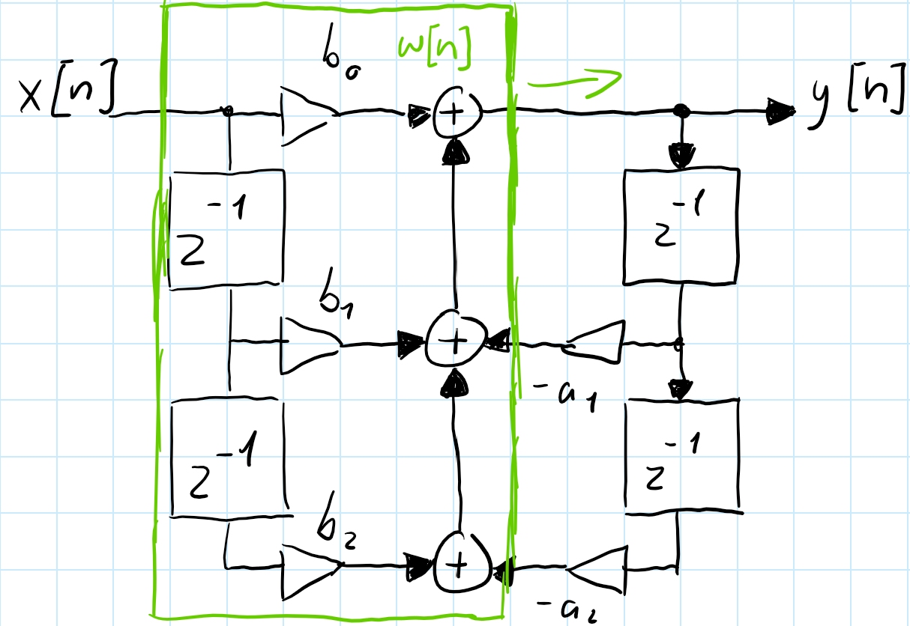
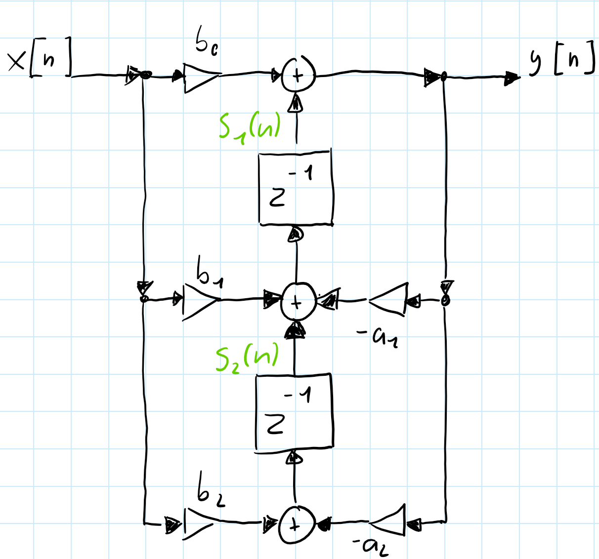
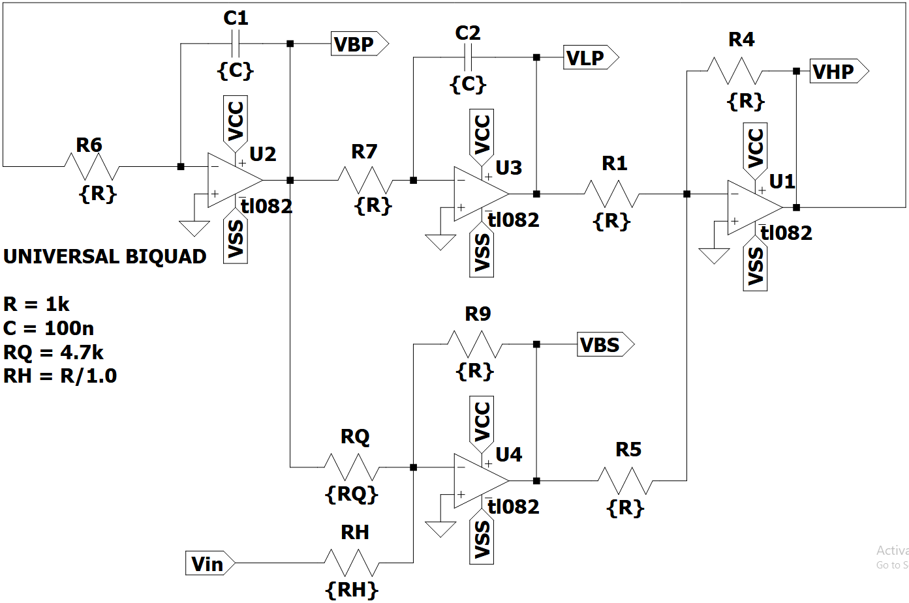
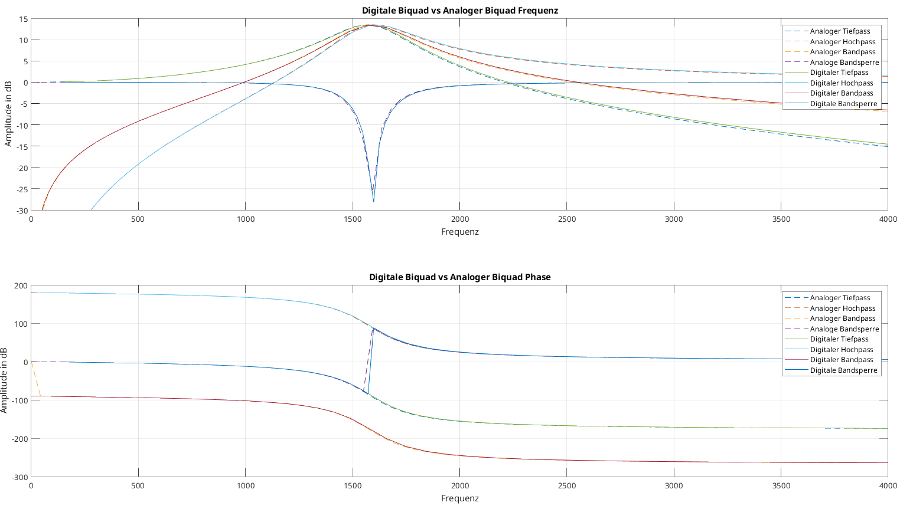
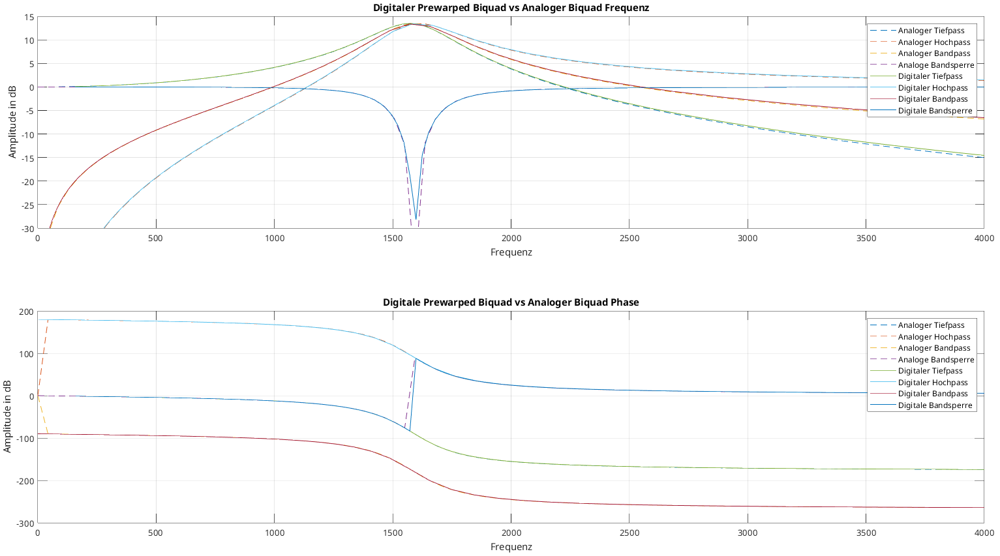



# Theoretische Grundlagen

## Infinite Impulse Response (IIR-Filter)
Infinite Impulse Response (IIR) Filter gehören in der Signalverarbeitung zu den grundlegenden Typen der digitalen Filter. IIR-Filter zeichnen sich fundamental durch ihre characteristik aus, bei der Berechnung des aktuellen Ausgangswertes durch die Verwendung des gegenwärtigen und vergangenen Eingabewertes als auch des vorherigen Ausgabewertes. Aufgrund dieser Rückkopplung kann es dazu führen, dass die Impulsantwort von IIR-Filtern theoretisch unendlich lang andauern kann, was sie grundsätzlich von Finite Impulse Response (FIR) Filtern unterscheidet.

Die theoretischen Grundlagen von IIR-Filtern basieren auf der Tatsache, dass die Filter sowohl Nullstellen als auch Polstellen besitzen. Während FIR-Filter ausschließlich Nullstellen aufweisen, ermöglichen die Polstellen von IIR-Filtern eine effizientere Umsetzung bestimmter Filtereigenschaften. Dies führt zu dem Hauptvorteil von IIR-Filter für die Möglichkeit scharfe Übergänge im Frequenzgang mit relativ wenigen Koeffizienten zu erreichen.

Ein immenser Vorteil von IIR-Filtern liegt in der hohen Effizienz bei der Realisierung scharfter Frequenzgänge mit relativ wenigen Koeffizienten, während FIR-Filter für vergleichbare Filtereigenschaften oft hunderte von Koeffizienten benötigen, können IIR-Filter ähnliche Ergebnisse mit deutlich geringerem Rechenaufwand erreichen. Aufgrund dieser Eigenschaft eignen sich IIR-Filter besonders gut im Einsatz von Systemen mit beschränkten Ressourcen oder in Echtzeitverarbeitung.

Biquadratische Filter, kurz als "Biquad" bezeichnet, sind eine spezielle Unterklasse von IIR-Filtern zweiter Ordnung. Durch das Kaskadieren solcher Biquad-Sektionen besteht die möglichkeit komplexe IIR-Filter höhrer Ordnung auf einfache Weise zu realsieren. Das Kaskadieren dieser Sektionen bringt Vorteile in Bezug auf numerische Stabilität, Flexibilät bei der Parameteranpassung und Modularität des Designs.

Die Verwendung von Biquad-Sektionen anstelle von Filtern höherer Ordnung in direkter Form bietet eine Vielzahl von Vorteilen. Die Anfälligkeit für Koeffizientenquentisierung wird enorm gemindert, da die Pole und Nullstellen weniger stark von kleinen Änderungen der Koeffizienten abhängen. Im weiteren ermöglicht die modulare Struktur eine unbahängige Optimierung jeder Sektion, wodurch der Entwurfsprozess vereinfacht wird. 

## Differenzengleichung eines IIR-Filters zweiter Ordnung
Digitale Filter können mit einer linearen Differenzengleichung beschrieben werden. Die biquadratischen Filter werden mit der Differenzengleichung eines IIR-Filters zweiter Ordnung beschrieben werden:

$$
y[n] =  \frac{1}{a_0}(b_0 \cdot x[n] + b_1 \cdot x[n - 1] + b_2 \cdot x[n - 2] - a_1 \cdot y[n - 1] - a_2 \cdot y[n - 2])
$$

Der Wert $y[n]$ bezeichnet den Ausgabewert zum Sample $n$, während $x[n]$ den Eingangswert darstellt. Der aktuelle Ausgabewert $y[n]$ ergibt sich aus der gewichteten Summe der aktuellen und zwei vergangenen Eingabewerte, subtrahiert mit den zwei gewichteten vergangen Ausgabewerte. 

Die Koeffizienten $b_0$, $b_1$ und $b_2$ bestimmen den Einfluss des aktuellen und der vergangenen Eingabewerte (Feedforward), während $a_1$ und $a_2$ den Rückkopplungsanteil aus früheren Ausgabewerten (Feedback) modellieren. Im Allgemeinem wird der Koeffizient auf $a_0$ auf 1 normiert, was zu der vereinfachten Form führt:

$$
y[n] = b_0 \cdot x[n] + b_1 \cdot x[n - 1] + b_2 \cdot x[n - 2] - a_1 \cdot y[n - 1] - a_2 \cdot y[n - 2]
$$

Durch diese Normierung wird die praktische Implementierung vereinfacht, da ein Muliplikationsschritt entfällt.

## Übertragungsfunktion eines IIR-Filters zweiter Ordnung

Zur Analyse des Frequenz- und Phasenverhaltens des Filters, wird die Differenzengleichung mittles der z-Transformation in den z-Bereich transformiert und daraus folgt die resultierende Übertragunsfunktion:

$$
H(z) = \frac{Y(z)}{X(z)} = \frac{b_0 + b_1 z^{-1} + b_2 z^{-2}}{1 + a_1 z^{-1} + a_2 z^{-2}}
$$

Die rationale Funktion eines biquadratischen Filters beschreibt das Verhältnis zwischen dem Ausgang $Y(z)$ zu dem Eingang $X(z)$. Diese Gleichung stellt die normierte Form des Biquads dar, bei welcher der Nennerkoeffizient auf $a_0 = 1$ normiert ist. Für den Fall, dass $a_0 ≠ 1$ beträgt müssen die Koeffzienten durch $a_0$ geteilt werden um die Normalform zu erreichen.

Anhand der Übetragungfunktion können die Pol- und Nullstellen des Filters analyziert werden, um die Stabilität des Biquad-Filters zu vergewissern. Dabei müssen alle Polstellen des Filters innerhalb des Einheitskreises der z-Ebene liegen, beziehungsweise der Betrag jedes Pols kleiner als 1 sein muss.

Befinden sich Pole außerhalb oder direkt auf dem Einheitskreis, kann es dazu kommen dass das Ausgangssignal unkontrolliert schwingt und das System damit instabil wird. Nullstellen haben hingegen lediglichen Einfluss auf die Frequenzcharakteristik und nicht direkt auf die Stabilität.

## Stabilität und Pol-Nullstellen-Verteilung

Die Stabilität eines IIR-Filters ist ein kritischer Faktor, wechler für die Implementierung des Filters gegeben sein muss. Ein kausaler IIR-Filter ist genau dann stabil, wenn alle Polstellen seiner Übertragungsfunktion innerhalb des Einheitskreises der komplexen z-Ebene liegen. Mathematisch ausgedrückt muss für alle Polstellen $|p_i| < 1$.

Die Lage der Pole bestimmt nicht nur die Stäbilität, sondern auch das dynamische Verhalten des Filters. Pole die näher am Rand des Einheitskreises liegen führen zu einem resonanten Verhalten mit langen ausschwingendem Verhalten, während Pole näher zum Ursprung hin, ein gedämpfteres Verhalten bewirken. Die Nullstellen hingegen beeinflussen primär dern Verlauf des Frequenzgangs.

Für die praktische Implementierung ist es wichtig zu beachten, dass Quantisierungseffekte sich auf die Lage der Pole auswirken können. Das kann im schlimmsten Fall dazu führen, sodass die Stabilität des Filters beeinträchtigt und der Filter instabil wird. Aus diesem Grund ist bei der  Koeffizientenquantisierung besondere Vorsicht geboten, bei Filtern mit Polen nah oder auf dem Rand des Einheitskreises.

## Frequenzgang und Phasenverhalten

Die Frequenzgang einew IIR-Filters wird durch die Auswertung der Übertragungsfunktion innerhalb des Einheitskreises erhalten, dafür wird die Substitution $z = e^{j\omega}$ druchgeführt:

$$
H(e^{j\omega}) = \frac{b_0 + b_1 e^{-j\omega} + b_2 e^{-2j\omega}}{1 + a_1 e^{-j\omega} + a_2 e^{-j2\omega}}
$$

Der Betrag $|H(e^{j\omega})|$ beschreibt die Amplitudencharakteristik, während die Phase $\arg(H(e^{j\omega}))$ das Phasenverhalten wiedergibt. Bei IIR-Filtern ist das Phasenverhlten im Allgemeinen nicht linear, was in manchen Anwendugen als unererwünscht erweist.

# Implementierungsstrukturen biquadratischer Filter

Die praktische Implementierung von biquaratischen Filtern erfolgt durch die direkte Umsetzung der Differezengleichungen in Software oder Hardware. 

Dafür werden die verzögerten Eingangswerte $x[n-1]$ und $x[n-2]$, sowie die Ausgangswerte $y[n-1]$ und $y[n-2]$ in Speicherelementen, sogenannten Verzögerungsgliedern, gespeichert. Der aktuelle Ausgangswert $y[n]$ wird mittels der gewichteten Summation aller Terme gemäß der jeweiligen Differenzengleichung berechnet.

Bei der numerischen Implementierung sind verschiedene Aspekte zu berücksichtigen, insbesondere die Wortbreite und des Zahlenformats (Festkomma oder Gleitkomma).

Weitere Einflüsse wie Rundungsfehler oder Quantisierungsrauschen können die Filtercharakteristik beeinflussen und im Extremfall die Stabilität des Filters gefährden.

Diese Implementierungsstrukturen bieten die Möglichkeit mehrere Filter-Sektionen aneinander zu Verbinden. Diese Modularität biquadratischer Filter ermöglicht, komplexere Filtersysteme höherer Ordnung, durch die Kaskadierung mehrerer Biquad-Sektionen zu realisieren. 

Dadurch können Vorteile im Bezug auf numerische Stabilität, Designflexibiltät und Implementierungseffizienz geschaffen werden, weil jede Sektion unabhängig entworfen und optimiert werden kann.

##  Direktform 1

Die Direktform 1 stellt die direkteste Umsetzung der biquadratischen Differenzengleichung in einer Signalflussstruktur dar. 

Diese Implementierung folgt direkt der mathematischen Beschreibung unter der Verwendung separater Verzögerungsketten für die Eingangs- als auch die Ausgangswerte. 

Diese Struktur kann als eine Parallelschaltung eines rein rekusiven Teils (nur Pole) und eines nicht rekursiven Teils (nur Nullstellen) aufgefasst werden.

$$
y[n] = b_0 \cdot x[n] + b_1 \cdot x[n - 1] + b_2 \cdot x[n - 2] - a_1 \cdot y[n - 1] - a_2 \cdot y[n - 2]
$$

Für die Direktform 1 Implementierung werden zunächst alle gewichteten Eingangswerte und deren Verzögerungen zusammengefasst und berechnet:

$$
w[n] = b_0 \cdot x[n] + b_1 \cdot x[n - 1] + b_2 \cdot x[n - 2]
$$

Anschließend wird die Rückkoppling der verzögerten Ausgangswerte realisiert:
$$
y[n] = w[n] - a_1 \cdot y[n-1] - a_2 \cdot y[n-2]
$$

{width=50%}

In dieser Struktur werden vier Verzögerungselemente verwendet: zwei für die Eingangsverzögerung, $x[n-1]$ und $x[n-2]$, sowie zwei für die Ausgangsverzögerung, $y[n-1]$ und $y[n-2]$. Die Multiplikationen zwischen den Verzögerungselementen und den Koeffizienten erfolgen parallel, wodurch sich eine hohe Verarbeitungsgeschwindigkeit erzielen lässt.

Ein wesentlicher Vorteil der Direktform 1 liegt in ihrer Robustheit gegenüber Koeffizientenquantisierung. Da die Feedforward- und Feedback-Pfade getrennt sind, beeinflussen Quantisierungsfehler in einem Pfad nicht direkt den anderen. Dies führt zu einer besseren numerenrischen Stabilität, besonders bei der Verwendung von Festkomma-Arithmetik.

Die Direktform 1 zeichnet sich durch ihre konzeptionelle Einfachheit und die direkte Korrespondenz zur Differenzengleichung aus. Nachteilhaft bei dieser Struktur ist der erhöhte Speicherbedarf, aufgrund der redundanten Verzögerungselemente. Für Anwendungen mit strengen Speicherbeschränkungen kann dies eine limitierender Faktor sein.

## Direktform 2 (Kanonische Form)

Die Direktform 2, oder auch als kanonische Form bekannt, ist eine optimierte Variante der Direktform 1, welche durch die Umordnung der Operationen die Anzahl der benötigten Verzögerungselemente minimiert.

Diese Struktur macht sich die Kommutativität (Vertauschbarkeit) linearer zeitinvarianter (LTI)-Systeme zunutze, indem sie die Reihenfolge von der Vorwärts- und Rückwärtsverarbeitung vertauscht.

{width=50%}

Zunächst wird ein Zwischenwert $w[n]$ durch die rekursive Beziehungen erzeugt:

$$
w[n] = x[n] - a_1 \cdot w[n-1] - a_2 \cdot w[n-2]
$$

Der Zwischenwert $w[n]$ dient als Substituion für die Verzögerungselemente der Ein- und Ausgangswerte.

$$
y[n] = b_0 \cdot w[n] + b_1 \cdot w[n-1] + b_2 \cdot w[n-2]
$$

In dieser Struktur werden nur zwei Verzögerungselemente für w[n-1] und w[n-2] benötigt, da die rekursive als auch die nicht-rekursive Verarbeitung auf diesleben verzögerten Werte zugreifen. Die Bezeichnung "kanonisch" bezieht sich darauf, dass diese Implementierung die minimal mögliche Anzahl von Verzögerungselementen verwendet und dadurch die Speichereffizienz optimiert.

Die Direktform 2 eignet sich Ideal für Systeme mit begrenzten Speicherressourcen. Der reduzierte Speicherbedarf ist insbesondere bei der Implementierung auf Mikrocontrollern oder in FPGA-Anwendungen von hohem Vorteil, bei welchen Speicher eine limitierte und kostbare Ressource darstellt.

Jedoch weist diese Struktur eine erhöhte Anfälligkeit gegenüber Quantisierungseffekten auf, da die Zwischenwerte $w[n]$ größere Dynamikbereiche aufweisen können als die ursprünglichen Ein- und Ausgangswerte. Dies kann zu einer Verschlechterung des Signal-Rausch-Verhältnisses führen, insbesondere bei der Verwendung von Festkomma-Arithmetik mit begrenzter Wortbreite.

## Transponierte Direktform 2:

Die transponierte Direktform 2 kann gebildet werden durch die Anwendung des Transpositionstheorems auf die Direktform 2. Dieses Theorem besagt, dass die Umkehrung aller Signalflussrichtungen bei gleichzeitiger Vertauschung von Eingängen und Ausgängen eine äquivalente Übertragungsfunktion ergibt. Die resultierende Struktur weist oft günstigere numerische Eigenschaften auf, als die ursprüngliche Form.

{width=50%}

Die transponierte Direktform 2 wird druch die folgende Differenzengleichungen beschrieben:

$$
s_2[n] = b_2 \cdot x[n] - a_2 \cdot y[n]
$$

$$
s_1[n] =  s_2[n] + b_1 \cdot x[n] - a_1 \cdot y[n]
$$

$$
y[n] = s_1[n] + b_0 \cdot x[n]
$$

Bei der transponierten Direktform 2 werden die Zwischenwerte $s_1[n]$ und $s_2[n]$ als Verzögerungselemente verwendet. Diese Struktur eignet sich besonders gut in der Implementierung von Echtzeitanwendung, aufgrund ihrer effizienten Berechnung und der guten Eignung für parallele oder pipelined Hardware-Architekturen.

Ein wesentlicher Vorteil der transponierten Direktfrom 2 liegt in ihrer reduzierten Anfälligkeit gegenüber Koeffizientenquantisierung. Die Rückkopplungsschleifen sind kürzer als in der Direktform 2, was zu einer verbesserten numerischen Stabilität führt. Darüber hinaus ist die Struktur besonders gut für die Implementierung in Hardware geeignet, da die Berechnungen eine natürliche Pipeline-Struktur ausweisen.

# Numerische Aspekte und Quantisierungseffekte

Die praktische Implementierung digitaler Filter auf Systemen mit endlicher Wortlänge birngt verschiedene Herausforderungen mit sich. Diese Effekte können die Filterleistung erheblich beeinträchtigen und müssen bereits in beim Entwerfen berücksichtigt werden. Die wichtigsten numerischen Aspekte sind Koeffizientenquentisierung, Quantisierungsrauschen(Rundungsrauschen), Overflow-Probleme und nichtlineare Quantisierungseffekte.

## Koeffizientenquantisierung

Die Koeffizientenquantisierung ist einer der kritischen Aspekte bei der Implementierung digitaler Filter auf Systemen mit begrenzter Wortlänge. Bei der Darstellung der Filterkoeffizienten mit einer endlichen Anzahl von Bits entstehen Quantisierungsfehler, die zu einer Verschiebung der Pole und Nulstellen des Filters führen kann.

**Auswirkung der Koeffizientenquantisierung**

Die Quantisierung der Koeffizienten führt zu verschiedenen unerwünschten Effekten:

**Polverschiebung**: Die quantisierten Koeffizienten verschieben die Pole des Filters, was zu einer Änderung der Filtercharakteristik führt. Im schlimmsten Fall können die Pole aus dem Einheitskreis herauswandern und zu einem instabilen Filter führen.

**Frequenzgangverzerrung**: Die Verschiebung der Pole und Nullstellen führt zur Abweichung im Frequenzgang. Besonders kritisch ist dies bei scharfen Filtern mit hoher Güte.

**Stabilitätsverlust**: Pole am oder auf dem Rand des Einheitskreises kann bereits durch kleine Quantisierung zur Instabilität zur Instabilität führen. Die Wahrscheinlichkeit der Instabilität steigt mit abnehmender Wortlänge.

[Füller um Inhalte zu Differenzieren]: <> (-------------------------------------------------------------------------------------------------------------------------------------------------------)



[Füller um Inhalte zu Differenzieren]: <> (-------------------------------------------------------------------------------------------------------------------------------------------------------)

# Praktische Anwendung der Bilinear-Transformation
Die analogen Biquad Filter für die Anwendung der Bilineartransformation werden aus dem Experiment 4 des Analog Systems Lab Kit PRO entnommen.

## Übertragungsfunktionen der analogen Biquad Filter

**Tiefpass:**   $H_{TP}(s) = \frac{V_3}{V_i} = \frac{+H_0}{1 + \frac{s}{w_0Q} + \frac{s^2}{w_0^2}} = \frac{+H_0 \cdot w_0^2}{w_0^2 + \frac{sw_0}{Q} + s^2}$

**Hochpass:**   $H_{HP}(s) = \frac{V_1}{V_i} = \frac{H_0 \cdot \frac{s^2}{w_0^2}}{1 + \frac{s}{w_0Q} + \frac{s^2}{w_0^2}} = \frac{+H_0 \cdot s^2}{w_0^2 + \frac{sw_0}{Q} + s^2}$

**Bandpass:**   $H_{BP}(s) = \frac{V_2}{V_i} = \frac{-H_0 \cdot \frac{s}{w_0}}{1 + \frac{s}{w_0Q} + \frac{s^2}{w_0^2}} = \frac{-H_0 \cdot sw_0}{w_0^2 + \frac{sw_0}{Q} + s^2}$

**Bandsperre:** $H_{BS}(s) = \frac{V_4}{V_i} = \frac{(1 + \frac{s^2}{w_0^2 \cdot}) \cdot H_0}{1 + \frac{s}{w_0Q} + \frac{s^2}{w_0^2}} = \frac{(w_0^2 + s^2) \cdot H_0}{w_0^2 + \frac{sw_0}{Q} + s^2}$

## Analoge Filterschaltung


Um diese analogen Filter Bilinear zu transformieren stehen MATLAB sowie Python zur Verfügung, um die Durchführung der Substitutionen durchzuführen.

## Python
Python mit scipy.signal
```Python
numz, denz = bilinear(nums ,dens ,fs = fs)
```

```Python
import numpy as np
import matplotlib.pyplot as plt
from scipy.signal import freqs, bilinear, freqz
```
Für die Bilinear-Transformation wird die Scipy-Bibliothek mit dem Signal-Modul verwendet. Aus diesem Modul werden die Funktionen freqs, bilinear und freqz importiert. Für weitere Berechnungen wird Numpy als np importiert und für die Möglichkeit zum Plotten wird Matplotlib.pyplot als plt importiert.

```Python
R = 1000
C = 100e-9
w0 = 1 / (R * C)
Q = 4.7
fs = 44100
```
Aus dem Schaltbild der analogen Filterschaltung werden dessen Parameter entnommen. Die Kreisfrequenz $w_0$ berechnet sich durch  $w_0 = \frac{1}{R C}$. Der Wert $H_0$ beschreibt den Gainfaktor der Filterschaltungen und wird auf 1 gesetzt, wodurch dieser nicht mehr im Code aufkommt. Die digitalen Filter sollen für Audioanwendungen verwendet werden, weshalb die Wahl von 44,1 kHz als Abtastfrequenz getroffen wurde. Durch die Wahl der Abtastefrequenz von 44,1 kHz wird kein Prewarping benötigt, da die Frequenzverzerrung vernachlässigbar ist.

```Python
# Tiefpass Zähler
TP_nums = [0, 0, w0**2]

# Hochpass Zähler
HP_nums = [1, 0, 0]

# Bandpass Zähler
BP_nums =  [0, -w0, 0]

# Bandstop Zähler
BS_nums = [1, 0, w0**2]

# Nenner
dens = [1, w0/Q, w0**2]
```
Die Zähler und Nenner der Übertragungsfunktionen der analogen Filter werden als Listen übernommen. Die Listenelemente entsprechen den Koeffizienten in absteigender Potenzordnung: $[s^2, s^1, s^0]$. Die Nenner der vier Filter sind identisch und müssen nur einmal übernommen werden.


```Python
# Bilineartransformation

# Tiefpass
TP_numz, TP_denz = bilinear(TP_nums, dens, fs = fs)

# Hochpass
HP_numz, HP_denz = bilinear(HP_nums, dens, fs = fs)

# Bandpass
BP_numz, BP_denz = bilinear(BP_nums, dens, fs = fs)

# Bandstop
BS_numz, BS_denz = bilinear(BS_nums, dens, fs = fs)
```

Die Bilineartransformation wird durch `bilinear` durchgeführt, indem dieser Funktion die Zähler- und Nennerlisten der jeweiligen Filter mit der Abtastfrequenzen $f_s$ übergeben werden. Die Funktion liefert die  Zähler- und Nennerkoeffizienten der digitalen Übertragungsfunktion.




## MATLAB
```Matlab
[numz, denz] = bilinear(nums ,dens ,fs ,fp)
```
Der Prozess der Bilinear-Transformation in MATLAB ist vom Verlauf identisch zu dem in Python, jedoch bietet MATLAB den Vorteil der direkten Einbindung vom Prewarping.

Die direkte Anwendung des Prewarpings wird mit dem Parameter `fp` vorgenommen, welcher als Prewarping-Punkt dient. MATLAB berechnet automatisch die erforderliche Anpassung anhand der Abtastfrequenz `fs` und dem Prewarping-Punkt `fp` bei der Transformation der Filterkoeffizienten. Zur Demonstration wird eine `fp` von 1600 Hz gewählt:




[Füller um Inhalte zu Differenzieren]: <> (-------------------------------------------------------------------------------------------------------------------------------------------------------)



[Füller um Inhalte zu Differenzieren]: <> (-------------------------------------------------------------------------------------------------------------------------------------------------------)
